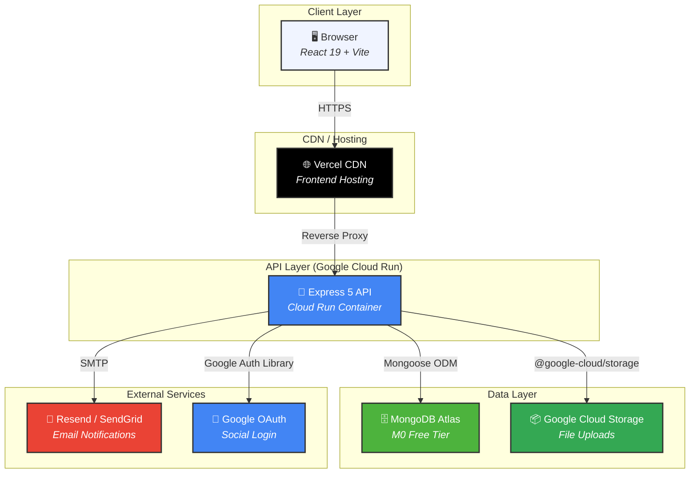
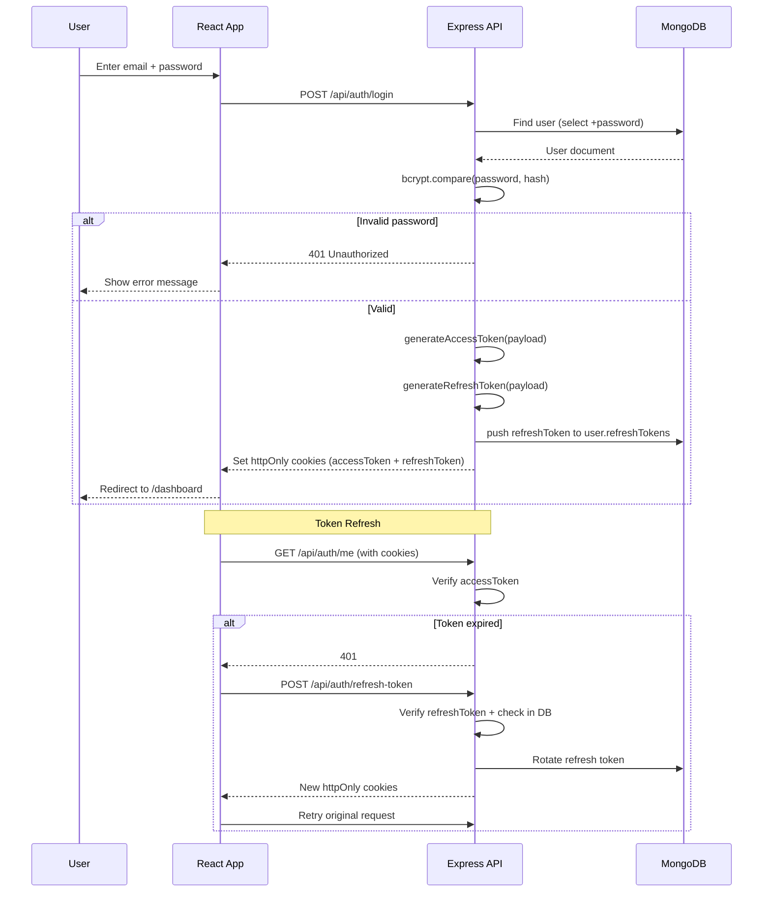
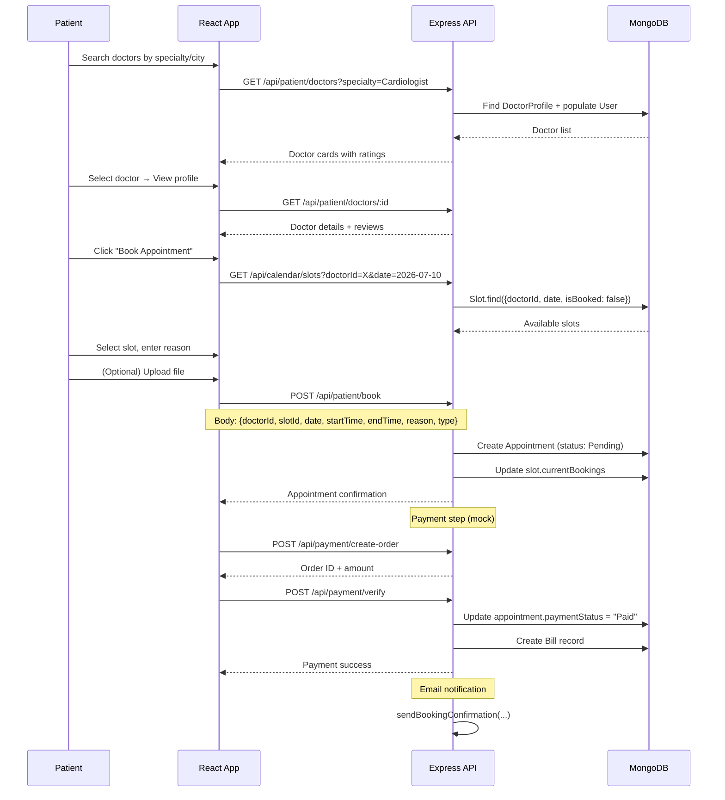
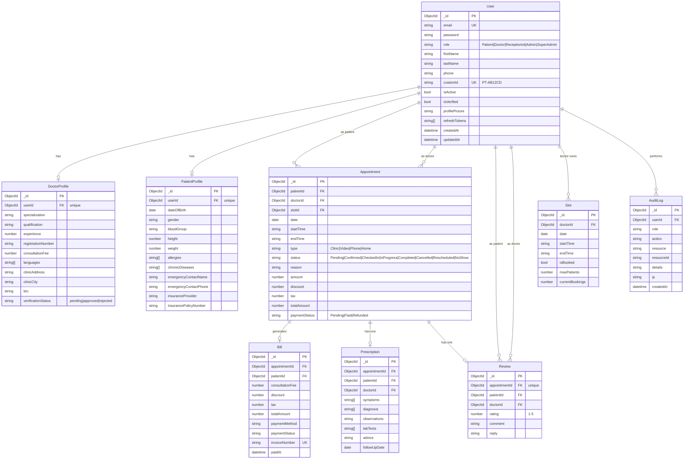
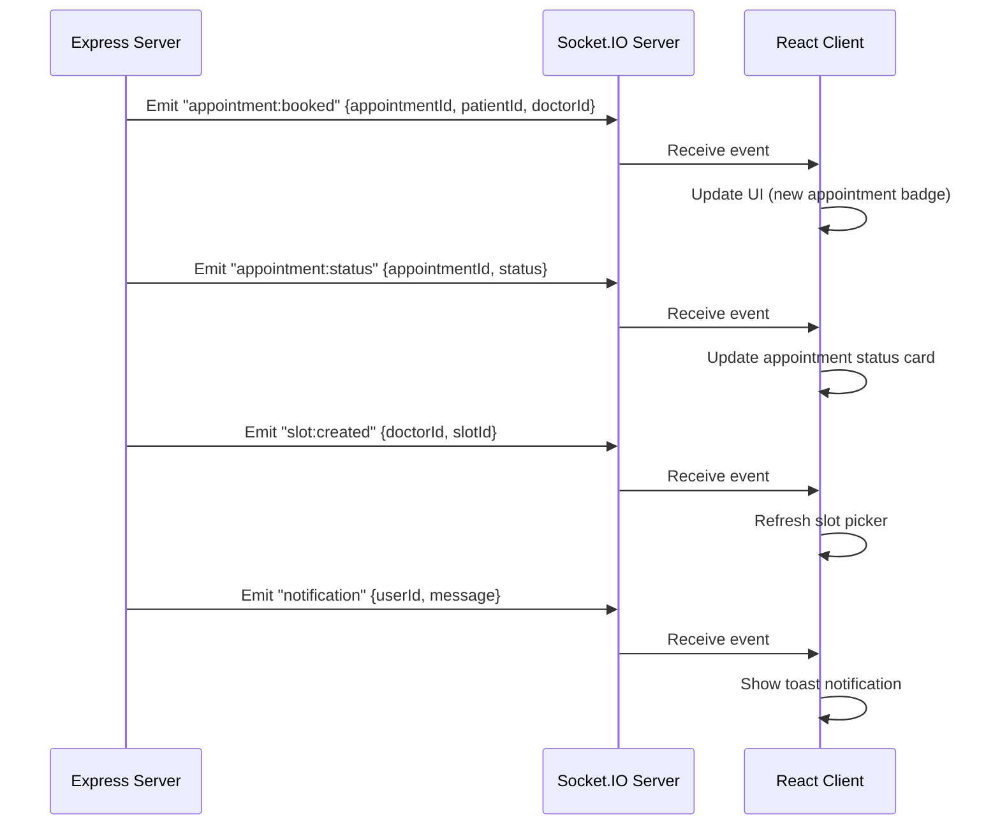

# MediBook — Architecture Document

> End-to-end architecture for the MediBook Doctor Appointment System

---

## Table of Contents

1. [System Architecture](#1-system-architecture)
2. [Technology Stack](#2-technology-stack)
3. [Authentication Flow](#3-authentication-flow)
4. [Booking Flow](#4-booking-flow)
5. [Data Models](#5-data-models)
6. [API Route Map](#6-api-route-map)
7. [Frontend Route Map](#7-frontend-route-map)
8. [Deployment Topology](#8-deployment-topology)
9. [Real-Time Events (Socket.IO)](#9-real-time-events-socketio)

---

## 1. System Architecture



---

## 2. Technology Stack

| Layer | Technology | Version | Purpose |
|---|---|---|---|
| **Frontend Framework** | React | 19.2.7 | UI rendering |
| **Frontend Build** | Vite | 8.1.1 | Dev server + bundler |
| **CSS** | Tailwind CSS | 3.4.19 | Utility-first styling |
| **Routing** | React Router | 7.18.1 | Client-side routing + RBAC guards |
| **Real-time Client** | Socket.IO Client | 4.8.3 | Live notifications |
| **Backend Framework** | Express | 5.2.1 | HTTP server + routing |
| **Backend Runtime** | Node.js | 22.x | Server-side JS |
| **Language** | TypeScript | 6.0.3 | Type safety (both FE/BE) |
| **Database** | MongoDB | 7.x (Atlas M0) | Document store |
| **ODM** | Mongoose | 9.7.4 | Schema modeling |
| **Auth** | JWT (jsonwebtoken) | 9.0.3 | Access + Refresh tokens in httpOnly cookies |
| **Validation** | Zod | 4.4.3 | Schema validation (FE+BE) |
| **Password Hashing** | bcryptjs | 3.0.3 | Password storage |
| **File Upload** | multer + GCS | 2.2.0 | Upload middleware |
| **Email** | nodemailer | 9.0.3 | SMTP email delivery |
| **Real-time Server** | Socket.IO | 4.8.3 | Server-sent events |
| **Security** | helmet + cors + rate-limit | Latest | HTTP security headers |

---

## 3. Authentication Flow



---

## 4. Booking Flow



---

## 5. Data Models



---

## 6. API Route Map

| Module | Method | Route | Auth | RBAC | Description |
|---|---|---|---|---|---|
| **Auth** | POST | `/api/auth/register` | No | No | Create account |
| | POST | `/api/auth/login` | No | No | Login |
| | POST | `/api/auth/logout` | No | No | Logout + clear cookies |
| | POST | `/api/auth/refresh-token` | No | No | Rotate refresh token |
| | POST | `/api/auth/forgot-password` | No | No | Send reset email |
| | POST | `/api/auth/reset-password` | No | No | Reset password |
| | GET | `/api/auth/me` | Yes | No | Current user |
| | POST | `/api/auth/change-password` | Yes | No | Authenticated password change |
| | POST | `/api/auth/verify-email` | No | No | Email verification |
| | POST | `/api/auth/resend-verification` | No | No | Resend verification |
| | POST | `/api/auth/google` | No | No | Google OAuth |
| | POST | `/api/auth/2fa/generate` | Yes | No | Generate 2FA secret |
| | POST | `/api/auth/2fa/verify` | Yes | No | Verify 2FA token |
| **Dashboard** | GET | `/api/dashboard/stats` | Yes | No | Role-based stats |
| **Patient** | GET | `/api/patient/doctors` | Yes | Patient | Search doctors |
| | GET | `/api/patient/doctors/:id` | Yes | Patient | Doctor profile |
| | POST | `/api/patient/book` | Yes | Patient | Book appointment |
| | GET | `/api/patient/appointments` | Yes | Patient | My appointments |
| | PATCH | `/api/patient/appointments/:id/cancel` | Yes | Patient | Cancel |
| | PATCH | `/api/patient/appointments/:id/reschedule` | Yes | Patient | Reschedule |
| | GET | `/api/patient/profile` | Yes | Patient | Get profile |
| | PUT | `/api/patient/profile` | Yes | Patient | Update profile |
| | GET | `/api/patient/records` | Yes | Patient | Medical records |
| | GET | `/api/patient/bills` | Yes | Patient | Payment history |
| **Doctor** | GET | `/api/doctor/appointments` | Yes | Doctor | My appointments |
| | PATCH | `/api/doctor/appointments/:id/status` | Yes | Doctor | Update status |
| | GET | `/api/doctor/patients/:id` | Yes | Doctor | Patient detail |
| | PUT | `/api/doctor/patients/:id/prescription` | Yes | Doctor | Write prescription |
| | GET | `/api/doctor/schedule` | Yes | Doctor | My slots |
| | POST | `/api/doctor/schedule` | Yes | Doctor | Add slot |
| | DELETE | `/api/doctor/schedule/:id` | Yes | Doctor | Remove slot |
| **Receptionist** | GET | `/api/receptionist/queue` | Yes | Receptionist | Today's queue |
| | PATCH | `/api/receptionist/appointments/:id/checkin` | Yes | Receptionist | Check-in |
| | POST | `/api/receptionist/walk-in` | Yes | Receptionist | Walk-in |
| | POST | `/api/receptionist/billing` | Yes | Receptionist | Generate bill |
| **Admin** | GET | `/api/admin/doctors` | Yes | Admin | Manage doctors list |
| | POST | `/api/admin/doctors` | Yes | Admin | Add doctor |
| | GET | `/api/admin/patients` | Yes | Admin | Manage patients |
| | GET | `/api/admin/appointments` | Yes | Admin | All appointments |
| | GET | `/api/admin/reports` | Yes | Admin | Reports |
| | GET | `/api/admin/license` | Yes | Admin | License requests |
| | PATCH | `/api/admin/license/:id` | Yes | Admin | Approve/reject |
| **SuperAdmin** | GET | `/api/super-admin/dashboard` | Yes | SuperAdmin | Dashboard |
| | POST | `/api/super-admin/hospitals` | Yes | SuperAdmin | Add hospital |
| | GET | `/api/super-admin/users` | Yes | SuperAdmin | All users |
| | PATCH | `/api/super-admin/users/:id/toggle` | Yes | SuperAdmin | Activate/deactivate |
| **Reviews** | GET | `/api/reviews/doctor/:id` | Yes | All | Doctor reviews |
| | POST | `/api/reviews` | Yes | Patient | Submit review |
| **Calendar** | GET | `/api/calendar/slots` | Yes | All | Available slots |
| **Payment** | POST | `/api/payment/create-order` | Yes | Patient | Create order |
| | POST | `/api/payment/verify` | Yes | Patient | Verify payment |
| **Upload** | POST | `/api/upload` | Yes | All | File upload (→ GCS) |
| **PDF** | GET | `/api/pdf/prescription/:id` | Yes | All | Download PDF |
| **Pharmacy** | CRUD | `/api/pharmacy` | Yes | Admin | Manage pharmacies |
| **Session** | GET | `/api/session/active` | Yes | All | Active sessions |
| **Health** | GET | `/api/health` | No | No | Health check |

---

## 7. Frontend Route Map

```
/login                                    # Login page
/register                                 # Register page
/forgot-password                          # Forgot password
/reset-password                           # Reset password (with token)

# Authenticated (Navbar + ProtectedRoute)
/dashboard                                # Role-based dashboard
/change-password                          # Change password
/calendar                                 # Calendar view

# Patient routes (role: Patient)
/patient/search                           # Find a doctor
/patient/doctors/:doctorId                # Doctor profile
/patient/book/:doctorId                   # Book appointment
/patient/appointments                     # My appointments
/patient/reschedule/:appointmentId        # Reschedule
/patient/profile                          # Patient profile
/patient/records                          # Medical records
/patient/reviews/:doctorId                # Submit review
/patient/bills                            # Payment history

# Doctor routes (role: Doctor)
/doctor/appointments                      # Doctor's appointments
/doctor/patients/:patientId               # Patient detail + prescription
/doctor/schedule                          # Manage slots

# Receptionist routes (role: Receptionist)
/receptionist/queue                       # Check-in queue
/receptionist/walk-in                     # Walk-in registration
/receptionist/billing                     # Billing

# Admin routes (role: Admin or SuperAdmin)
/admin/doctors                            # Manage doctors
/admin/patients                           # Manage patients
/admin/appointments                       # All appointments
/admin/reports                            # Reports
/admin/license                            # License management

# SuperAdmin routes (role: SuperAdmin)
/super-admin/dashboard                    # SuperAdmin dashboard

# Catch-all
* → redirect to /dashboard
```

---

## 8. Deployment Topology

```mermaid
graph LR
    subgraph "DNS"
        DNS["Route 53 / Namecheap"]
    end

    subgraph "Vercel"
        FE["medibook.vercel.app<br/>→ React SPA<br/>Env: VITE_API_URL"]
    end

    subgraph "Google Cloud Run"
        API["api-XXXXX-uc.a.run.app<br/>→ Express Container<br/>16 route modules"]
    end

    subgraph "MongoDB Atlas"
        ATLAS["M0 Cluster<br/>doctor-appointment<br/>5 collections"]
    end

    subgraph "Google Cloud Storage"
        BUCKET["medibook-uploads<br/>Bucket"]
    end

    subgraph "GitHub"
        GH["github.com/Rinzlertron456/<br/>Viazo_Technologies_Assessment"]
    end

    DNS --> FE
    DNS --> API
    FE --> API
    API --> ATLAS
    API --> BUCKET
    GH --> FE
    GH --> API

    style DNS fill:#FF9900,stroke:#333,color:#fff
    style FE fill:#000,stroke:#333,color:#fff
    style API fill:#4285F4,stroke:#333,color:#fff
    style ATLAS fill:#4DB33D,stroke:#333,color:#fff
    style BUCKET fill:#34A853,stroke:#333,color:#fff
```

### Deployment Variables

| Variable | Frontend (Vercel) | Backend (Cloud Run) |
|---|---|---|
| **Hosting Type** | Static SPA + CDN | Container (Docker) |
| **Scale** | Global CDN, never sleeps | Auto-scale (min=1) |
| **HTTPS** | Automatic | Automatic |
| **Custom Domain** | `medibook.yourdomain.com` | `api.yourdomain.com` |
| **Build Command** | `npm run build` → `dist/` | `docker build -t gcr.io/...` |
| **Environment** | `VITE_API_URL` | `MONGODB_URI`, `CLIENT_URL`, `SMTP_*`, `GOOGLE_*` |
| **Deploy Trigger** | Git push to main | Git push + Cloud Build |

---

## 9. Real-Time Events (Socket.IO)



---

## 10. Directory Structure

```
Viazo_Technologies_Assessment/
├── ARCHITECTURE.md                          # ← This file
├── TEST_CREDENTIALS.md                      # Pre-seeded test accounts
├── TESTING.md                               # Manual + e2e test guide
│
├── Doctor-Appointment-Client/               # Frontend (React + Vite)
│   ├── src/
│   │   ├── App.tsx                          # Router + Layout
│   │   ├── main.tsx                         # Entry point
│   │   ├── index.css                        # Tailwind base
│   │   ├── contexts/
│   │   │   └── AuthContext.tsx              # Auth state (useReducer + Context)
│   │   ├── components/
│   │   │   ├── Button.tsx                   # Reusable button
│   │   │   ├── Navbar.tsx                   # Top navigation
│   │   │   ├── ProtectedRoute.tsx           # RBAC route guard
│   │   │   ├── Modal.tsx                    # Confirm modal
│   │   │   └── ...                          # PhoneInput, Select, etc.
│   │   ├── pages/
│   │   │   ├── auth/                        # Login, Register, Forgot/Reset Password
│   │   │   ├── dashboard/                   # Role-based dashboard
│   │   │   ├── patient/                     # Doctor search, Book, Appointments, Profile
│   │   │   ├── doctor/                      # Appointments, Schedule, Patient detail
│   │   │   ├── receptionist/                # Queue, Walk-in, Billing
│   │   │   ├── admin/                       # Manage doctors/patients, Reports, License
│   │   │   └── superadmin/                  # SuperAdmin dashboard
│   │   ├── services/
│   │   │   └── api.ts                       # HTTP client (env-based base URL)
│   │   ├── types/
│   │   │   └── auth.ts                      # TypeScript interfaces
│   │   └── utils/
│   │       ├── validation.ts                # Form validation
│   │       ├── countries.ts                 # Phone number parser
│   │       └── statusLabels.ts             # Appointment status labels
│   └── vite.config.ts                       # Vite config + proxy
│
├── Doctor-Appointment-Server/               # Backend (Express + TypeScript)
│   ├── src/
│   │   ├── server.ts                        # Entry point (connect DB → seed → listen)
│   │   ├── app.ts                           # Express app (middleware + routes)
│   │   ├── config/
│   │   │   ├── env.ts                       # Environment variables
│   │   │   └── db.ts                        # Mongoose connection
│   │   ├── models/                          # Mongoose schemas (10 models)
│   │   ├── controllers/                     # Route handlers (13 controllers)
│   │   ├── routes/                          # Express routers (17 route files)
│   │   ├── middleware/                      # Auth, RBAC, Error handler, Validation, Audit
│   │   ├── services/                        # Email, Notifications
│   │   ├── utils/                           # JWT, Cookies, Errors, Dates
│   │   ├── validators/                      # Zod schemas
│   │   └── scripts/
│   │       └── seed.ts                      # Auto-provision test accounts
│   ├── tsconfig.json
│   └── package.json
│
├── docker-compose.yml                       # Local dev with MongoDB
└── README.md
```

---

*Generated: July 2026*  
*MediBook — Doctor Appointment System*
